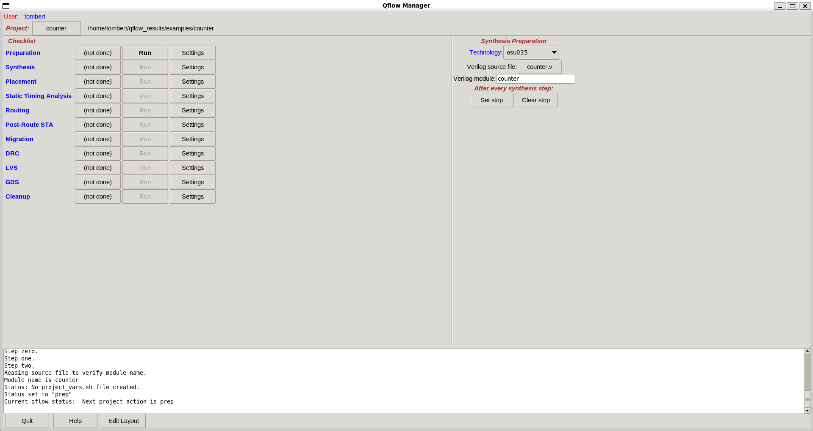
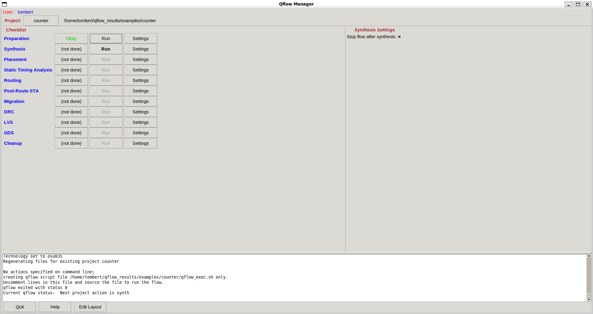
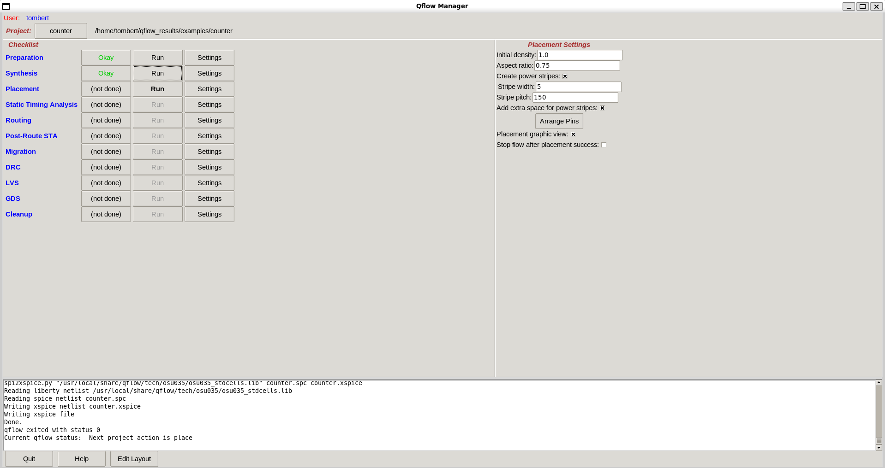
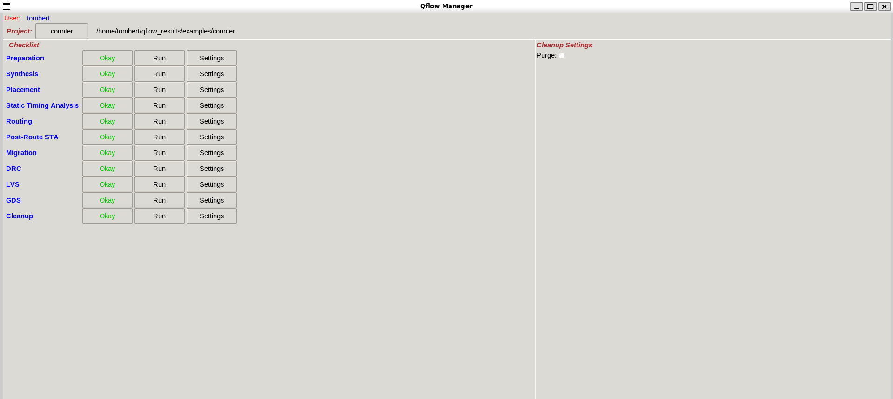

# Qflow Automated Setup & Example Projects

This repository provides a fully automated setup for Qflow, allowing users to:  
✅ Install all required tools & dependencies with a single script.  
✅ View pre-generated example layouts using Magic.  
✅ Run Qflow on custom Verilog designs to generate layouts.  

The script ensures that **Qflow, GrayWolf, Netgen, Magic, and other required tools** are installed correctly, resolving common setup issues.

## 🚀 Quick Setup
1. **For clean procedure, create a new folder and open it in terminal**
2. **Clone this repo**:
   ```sh
   git clone https://github.com/Pratim-Senapati/qflow-projects.git
   cd qflow-projects
   ```
3. **Run setup script (installation and setup of required tools)**:
   ```sh
   python3 install_and_run.py
   ```
4. **Verify Installation**:
   ```sh
   qflow -help
   magic -T scmos.tech
   ```
5. **Done! 🎉** You can now see example projects or use your own Verilog files.

## 🔍 How to View Layouts and Run your Own Verilog

To see one of the example files, go to `examples/cordic/layout`. Then run
```sh
magic /home/user/qflow-projects/examples/cordic/layout/cordic.mag
```
This command can be run from anywhere(absolute path of `cordic.mag` needs to be used). Replace `user` with your user name.
And to use your own verilog code and run it through the whole process, go to the directory the code is in.
As example `demo.v` is inside `demo`. So go to `/demo` and then run
```sh
qflow gui
```
This will open the **Qflow GUI**, as shown below

In right part of window technology should be selected `osu035` as it is given with Qflow as default. For verilog souce file select `demo.v`.
At left part of window on the same row as `Preparation`, click `Run`.This will take you to the next step `Synthesis`, as shown below

From here onwards, tick `Stop flow after ...`. That way you can see every step clearly. Hit `Run` again.

After this step is done, you can go to `Edit Layout` to see the layout. As steps are completed, layout will be finalised.
If everything goes smoothly final window should look like this.


## 📂 Files in This Repo
- **Verilog Source Files (`examples/project/src/`)** → Original design files
- **Synthesis Results (`examples/project/synthesis/`)** → Converted to logic gates
- **Final Layout (`examples/project/layout/`)** → Chip representation
- **Logs (`examples/project/log/`)** → Step-by-step processing info

## ✅ **Final Notes**

In This Repo:
1. **README.md** → General repo guide
2. **qflow_overview.md** → Explanation of tools used throughout the process

Go through the examples to see some of my complex designs based on `4-point FFT` and `2x2 Mesh Network-on-Chip`.

If run into any issues feel free to refer to `http://opencircuitdesign.com/qflow/tutorial.html`
